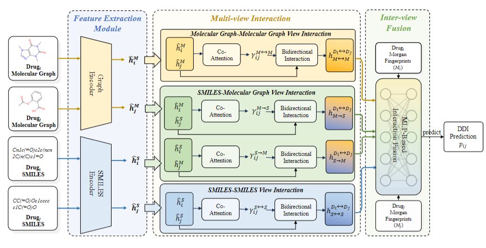

# 💊MvDDI: A Multi-view Interaction Framework for Few-shot Drug-Drug Interaction

This is the code repository for the paper: MvDDI: A Multi-view Interaction Framework for Few-shot Drug-Drug Interaction (**NLPCC 2025**).



# 💻Environment Setting

**cuda version:** `11.7`

**python version:** `3.8`

Some required python packages:

```
networkx = 3.1
numpy = 1.19.5
rdkit = 2023.9.5
torch = 2.0.1
tqdm = 4.66.2
transformers = 4.39.1
pandas = 1.4.4
scikit-learn = 1.3.2
```

**You can execute the following command to install the required packages:**

```bash
pip install -r requirment.txt
```

# 📂Dataset

## Few-shot Dataset

All few-shot datasets are in the `data` folder, `Few-Drugbank` is `data/drugbank`, `Few-TWOSIDES` is `data/twosides`, and `Few-S1` and `Few-S2` are in `data/inductive_data`.

The data in the specific dataset are as follows:

### Transductive Setting

| Class | Few-Drugbank | Few-TWOSIDES |
| :--- | :--- | :--- |
| Train | 4,247 | 5,792 |
| Valid | 1,311 | 1,926 |
| Test | 37,577 | 790,298 |

### Inductive Setting

| Class | Few-S1 | Few-S2 |
| :--- | :--- | :--- |
| Train | 5,213 | 5,213 |
| Valid | 677 | 1,293 |
| Test | 7,007 | 52,163 |

## Data Format

Each data item in the Few-shot Dataset is a four-tuple **(d1, d2, type, Neg samples)**. A specific example is:

```
DB01173,DB06144,15,DB00765$h
```

It indicates that **DB01173** and **DB06144** have a reaction type of category **15**. **DB00765**$h indicates that **DB00765** and **DB06144** have no reaction type, which is represented as the corresponding Negative sample.

# 🔬Experiment
## Transductive setting

```bash
python train_trans.py --data_dir data --dataset {drugbank, TWOSIDES} --fold {0, 1, 2} --smiles_model_path [SMILES_MODEL] --mol_model_path [MOL_MODEL] --dropout [DROPOUT] --device [DEVICE] --batch_size [BATCHSIZE] --model_path [MODEL_PATH] --test [TEST]
```

Argument

```
--data_dir  Few-shot dataset or alldata dataset. Choose from {data, alldata}.
--dataset Dataset to be trained on.Choose from {drugbank, twosides}
--fold fold of the dataset to be trained on. Choose from {0, 1, 2}
--smiles_model_path SMILES encoder. Default = model/MoLFormer-XL-both-10pct
--mol_model_path SMILES encoder. Default = model/grover_large.pt
--dropout dropout probability in [0-1]. Default=0.1.
--device Model train device. Default = cuda:1/cpu
--batch_size Batch size of DDI triplets. Default=32.
--model_path The path to use the trained model. Default=None.
--test Whether to perform testing only. Default=False.
```

## Inductive setting

```bash
python train_induct.py --data_dir data --dataset inductive_data --fold {0, 1, 2} --smiles_model_path [SMILES_MODEL] --mol_model_path [MOL_MODEL] --dropout [DROPOUT] --device [DEVICE] --batch_size [BATCHSIZE] --s1 [S1_MODEL_PATH] --s2 [S2_MODEL_PATH] --test [TEST]
```

Argument

```
--data_dir  Few-shot dataset or alldata dataset. Choose from {data, alldata}.
--dataset Dataset to be trained on.
--fold fold of the dataset to be trained on. Choose from {0, 1, 2}
--smiles_model_path SMILES encoder. Default = model/MoLFormer-XL-both-10pct
--mol_model_path SMILES encoder. Default = model/grover_large.pt
--dropout dropout probability in [0-1]. Default=0.1.
--device Model train device. Default = cuda:1/cpu
--batch_size Batch size of DDI triplets. Default=32.
--s1 The path to use the trained s1 model. Default=None.
--s2 The path to use the trained s2 model. Default=None.
--test Whether to perform testing only. Default=False.
```

During the training process, the best model address is stored at:

```python
model_save = f'./model/{args.dataset}/{datetime.now().strftime("%m_%d_%H_%M_%S")}/'
```

After the training is completed, the test set will be automatically called for testing, and the results will be saved in the save file.

```python
result_save = f'./table/{args.dataset}/{datetime.now().strftime("%m_%d_%H_%M_%S")}.csv'
```

All training results will be saved in log files.

```python
log_path = f'log/{args.dataset}/{datetime.now().strftime("%m_%d_%H_%M_%S")}.log'
```

## 📱Concat
Please create Github issues here or email [Zihao Mao](aitejiu@csu.edu.cn) or [Libo Qin](lbqin@csu.edu.cn) if you have any questions or suggestions.